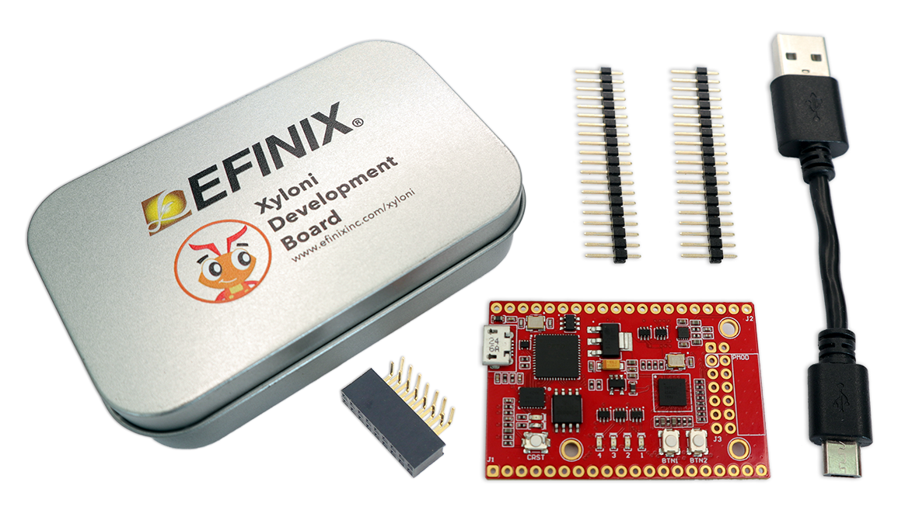

# Xyloni T8 Development Kit User Guide

Welcome to the Xyloni® Development Kit Github repo. This site provides projects and software you can use with your Xyloni® Development Board.

-   [What's in the Box?](#whats-in-the-box)
-   [Register Your Kit](#register-your-xyloni-development-kit)
-   [Install the Efinity Software](#install-the-efinity-software)
-   [Run the Out of Box Design](#run-the-out-of-box-design)
-   [Functional Description](docs/xyloni-github-headers.md)



-   Efinix® T8F81C2 device in an 81-ball FineLine BGA package
-   128 Mbit SPI NOR flash memory
-   FTDI FT4232H chipset with USB controller
-   Dedicated UART interface through USB
-   Micro-USB type B receptacle
-   41-pin high-speed connectors \(including PMOD\) for user I/O with unattached pin headers
-   12-pin PMOD-compatible GPIO socket
-   Micro-SD card slot
-   User LEDs and switches:
    -   4 LEDs on T8F81C2 bank 1B and 2B
    -   2 pushbutton switches \(connected to bank 2A I/O pins\)
-   33.33 MHz oscillator for T8F81C2 PLL input
-   Power:
    -   Power source: USB
    -   User selectable voltages from 1.8 V, 2.5 V, and 3.3 V for bank 2A and 2B through USB
-   Power good and T8F81C2 configuration done LEDs

The board features the Efinix® T8 programmable device in a 81-ball FBGA package, which is fabricated using Efinix® Quantum™ technology. The Quantum™-accelerated programmable logic and routing fabric is wrapped with an I/O interface in a small footprint package. T8 devices also include embedded memory blocks and multiplier blocks \(or DSP blocks\). You create designs for the T8 device in the Efinity® software, and then download the resulting configuration bitstream to the board using the USB connection.

**Note:** For more information on T8 FPGAs, refer to the [T8 Data Sheet](https://www.efinixinc.com/support/docsdl.php?s=ef&pn=DST8).

")

")

The FTDI FT4232H module has four channels to support the following interfaces:

-   FTDI interface 0 = SPI
-   FTDI interface 0 = JTAG
-   FTDI interface 0 = UART
-   FTDI interface 0 = VCCIO setting

It receives the T8 configuration bitstream from a USB host and writes to the on-board SPI NOR flash memory. After a reset in SPI passive mode, the FTDI controller can also write the configuration bitstream directly to the FPGA. Additionally, it supports direct JTAG programming mode in which it writes the configuration bitstream directly to the FPGA through the JTAG interface.

**Note:** Refer to [AN 006: Configuring Trion FPGAs](https://www.efinixinc.com/support/docsdl.php?s=ef&pn=AN006) for more information.

The SPI NOR flash memory stores the configuration bitstream it receives from the FTDI FT4232H module. The T8 device accesses this configuration bitstream when it is in active configuration mode \(default\).

The board regulates down the 5 V DC input using on-board switching regulators to provide the necessary voltages for the T8 device, PMOD module, SPI flash memory, and on-board oscillator.

## What's in the Box? { .section}

The Xyloni® Development Kit includes:

-   Xyloni® Development Board preloaded with a demonstration design
-   Mini-USB cable \(type B\)
-   3 unsoldered pin headers

## Register Your Xyloni® Development Kit { .section}

When you purchase an Efinix development kit, you also receive a copy of the Efinity® software plus one year of software upgrades and patches. The Efinity® software is available for download from the Support Center on the Efinix web site.

To get access to our Support Center to download your software, register your development kit at [https://www.efinixinc.com/register](https://www.efinixinc.com/register).

## Install the Efinity® Software { .section}

To develop your own designs for the T8 device on the board, you must install the Efinity® software. You can obtain the software from the Efinix® Support Center under Efinity Software \([www.efinixinc.com/support/](https://www.efinixinc.com/support/)\).

The Efinity® software includes tools to program the device on the board. Refer to the Efinity® Software User Guide for information about how to program the device.

**Note:** Efinity® documentation is installed with the software \(see **Help** \> **Documentation**\) and is also available in the Support Center under Documentation \([www.efinixinc.com/support/](https://www.efinixinc.com/support/)\).

## Run the Out of Box Design { .section}

Efinix® preloads the Xyloni® Development Board with an example design. The design includes two functions, the invert LED operation and the read SD card information operation. The read SD card information operation requires a terminal program in a computer and an SD card inserted into the SD card slot to display the SD card information.

The example design implements an open-source variation of the Efinix®'s Opal RISC-V SoC. The Opal RISC-V is a cacheless, small footprint SoC that is ideal for applications that require embedded compute capability such as system monitoring or remote configuration and control.


### Invert LED { .section}

Follow these steps to run the invert LED operation:

1.  Connect the USB cable to the board and to your computer. LED PWR turns on, indicating that the board is receiving power correctly. When configuration completes, the configuration done \(LED CDN\) turns on. The LEDs turn on sequentially from LED1 to LED4.

    **Note:** If LED PWR does not turn on, the board is not receiving power correctly.

2.  Press pushbutton BTN2 to invert the LEDs. The LEDs turn off sequentially from LED1 to LED4.

### Read SD Card Information { .section}

Follow these steps to run the read SD card information operation:

1.  Connect the USB cable to the board and to your computer. LED PWR turns on, indicating that the board is receiving power correctly. When configuration completes, the LED CDN turns on. The LEDs turn on sequentially from LED1 to LED4.

    **Note:** If LED PWR does not turn on, the board is not receiving power correctly.

2.  Insert the SD card into the SC card slot.
3.  Open a terminal software on the computer. You can use any Windows or Linux terminal applications such as, PuTTY, Tera Term, Minicom, and others.
4.  Select the com\[2\] port of UART connection in the terminal. Example:
    -   In Windows, if the terminal shows com30 com31 com32 com33, select com32.
    -   In Linux, if the terminal shows ttyUSB0 ttyUSB1 ttyUSB2 ttyUSB3, select USB2.
5.  Set the serial port baud-rate to 115200 bits per second.
6.  Press pushbutton BTN1. The terminal displays the following test menu:

    ```
    ==========Xyloni Test Menu==========
    ---Press BTN2 On Board - INVERT LED BLINK
    ---Press Keyboard 'Enter' Key  - READ SD CARD INFO
    ```

7.  Press the Enter key, and the terminal displays the SD card information. For example:

    ```
    =========SD Card Info=========
    
    Manufacturer ID    : 3
    Type               : Hard disk file system
    TRAN_SPEED         : 10Mbit/s
    SD CARD Size       : 15218 MByte
    ```

8.  If there is no SD card in the SD card slot, the terminal displays:

    ```
    Response Fail!! NO SD Card Detect
    ```

